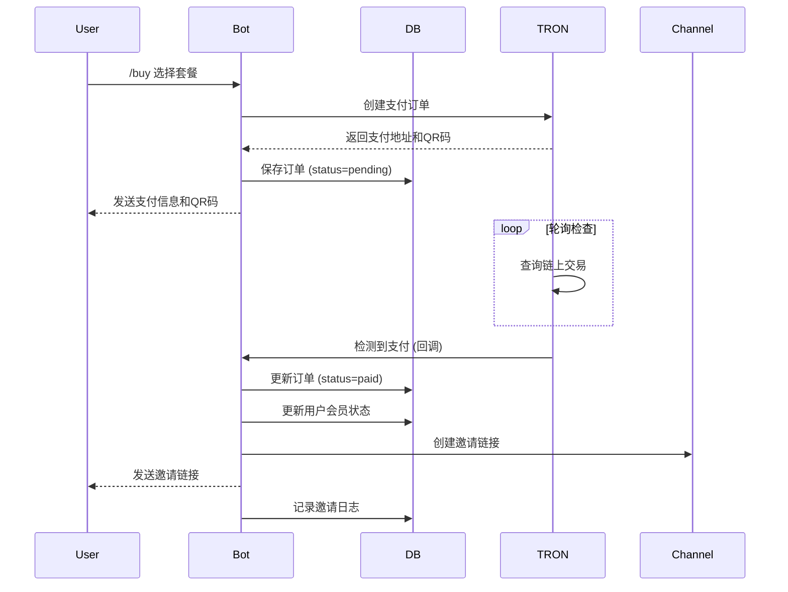
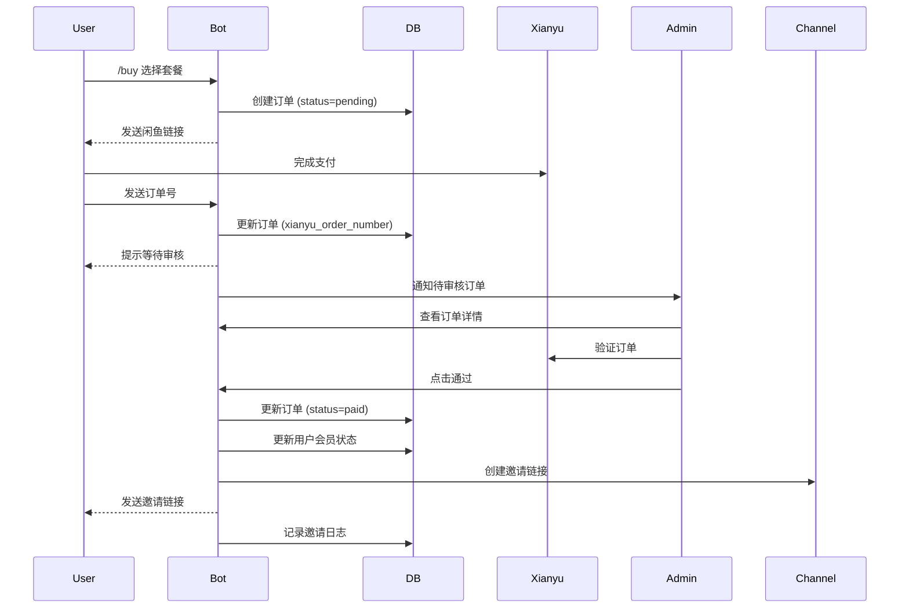
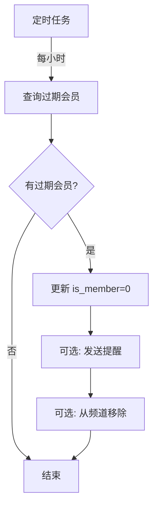

# 系统架构设计文档

## 📐 整体架构

```
┌─────────────────────────────────────────────────────────────┐
│                       Telegram Users                         │
└────────────────┬───────────────────────┬────────────────────┘
                 │                       │
                 ↓                       ↓
        ┌────────────────┐      ┌─────────────────┐
        │  Telegram Bot  │      │  Admin Commands │
        │   (bot.py)     │      │                 │
        └────────┬───────┘      └────────┬────────┘
                 │                       │
                 └───────────┬───────────┘
                             ↓
                 ┌───────────────────────┐
                 │  Database Layer       │
                 │  (database.py)        │
                 └───────┬───────────────┘
                         │
          ┌──────────────┼──────────────┐
          ↓              ↓              ↓
    ┌─────────┐   ┌─────────┐   ┌──────────┐
    │  Users  │   │ Orders  │   │  Logs    │
    │  Table  │   │  Table  │   │  Table   │
    └─────────┘   └─────────┘   └──────────┘
                       │
                       ├──── TRON Payment ────→ TronScan API
                       │      (tron_payment.py)
                       │
                       └──── Xianyu Payment ──→ Manual Review
```

## 🏗️ 模块设计

### 1. bot.py - Bot 主程序

**职责**：
- 处理用户交互
- 命令路由
- 回调处理
- 业务逻辑协调

**核心功能**：
```python
- start_command()           # 启动命令
- buy_command()            # 购买会员
- orders_command()         # 订单查询
- admin_command()          # 管理面板
- button_callback()        # 按钮回调处理
- handle_message()         # 消息处理
- invite_user_to_channel() # 邀请到频道
```

**状态管理**：
```python
user_states = {
    user_id: {
        'action': 'waiting_xianyu_order',
        'order_id': 'XY_123456_1234567890',
        'data': {...}
    }
}
```

### 2. database.py - 数据库层

**职责**：
- 数据持久化
- CRUD 操作
- 事务管理
- 数据查询

**核心类**：
```python
class Database:
    def __init__(db_path)
    def get_or_create_user()
    def update_user_membership()
    def create_order()
    def update_order_status()
    def get_statistics()
```

### 3. tron_payment.py - TRON 支付模块

**职责**：
- 生成支付订单
- 监控链上交易
- 自动确认支付
- 回调通知

**工作流程**：
```
创建订单 → 生成 QR 码 → 启动监控线程
    ↓
轮询 TronScan API
    ↓
检测到支付 → 触发回调 → 更新订单状态
```

### 4. config.py - 配置管理

**职责**：
- 环境变量加载
- 配置参数定义
- 套餐定义
- 消息模板

### 5. manage.py - 管理工具

**职责**：
- 数据查询
- 数据备份
- 数据导出
- 数据清理

## 📊 数据库设计

### ERD 关系图

```
┌─────────────────┐
│     users       │
├─────────────────┤
│ user_id (PK)    │
│ username        │
│ is_member       │
│ member_until    │
│ total_spent     │
└────────┬────────┘
         │
         │ 1:N
         │
┌────────┴────────────┐
│      orders         │
├─────────────────────┤
│ order_id (PK)       │
│ user_id (FK)        │
│ payment_method      │
│ status              │
│ amount              │
│ tron_tx_hash        │
│ xianyu_order_number │
└────────┬────────────┘
         │
         │ 1:N
         │
┌────────┴────────────┐
│  channel_invites    │
├─────────────────────┤
│ id (PK)             │
│ user_id (FK)        │
│ order_id (FK)       │
│ invited_at          │
└─────────────────────┘
```

### 表结构详解

#### users - 用户表

| 字段 | 类型 | 说明 |
|------|------|------|
| user_id | INTEGER PK | Telegram User ID |
| username | TEXT | 用户名 |
| first_name | TEXT | 名字 |
| last_name | TEXT | 姓氏 |
| is_member | BOOLEAN | 是否是会员 |
| member_since | TIMESTAMP | 成为会员时间 |
| member_until | TIMESTAMP | 会员到期时间 |
| total_spent_usdt | REAL | 总消费 USDT |
| total_spent_cny | REAL | 总消费人民币 |
| created_at | TIMESTAMP | 注册时间 |
| last_active | TIMESTAMP | 最后活跃时间 |
| notes | TEXT | 备注 |

**索引**：
- PRIMARY KEY: user_id
- INDEX: is_member
- INDEX: member_until

#### orders - 订单表

| 字段 | 类型 | 说明 |
|------|------|------|
| order_id | TEXT PK | 订单号 |
| user_id | INTEGER FK | 用户 ID |
| payment_method | TEXT | 支付方式 (tron/xianyu) |
| plan_type | TEXT | 套餐类型 |
| amount | REAL | 金额 |
| currency | TEXT | 币种 (USDT/CNY) |
| status | TEXT | 状态 (pending/paid/cancelled/expired) |
| created_at | TIMESTAMP | 创建时间 |
| paid_at | TIMESTAMP | 支付时间 |
| expired_at | TIMESTAMP | 过期时间 |
| cancelled_at | TIMESTAMP | 取消时间 |
| tron_tx_hash | TEXT | TRON 交易哈希 |
| tron_order_id | TEXT | TRON 订单 ID |
| xianyu_order_number | TEXT | 闲鱼订单号 |
| xianyu_screenshot | TEXT | 闲鱼截图（预留） |
| membership_days | INTEGER | 会员天数 |
| admin_notes | TEXT | 管理员备注 |
| user_notes | TEXT | 用户备注 |

**索引**：
- PRIMARY KEY: order_id
- INDEX: user_id
- INDEX: status
- INDEX: payment_method

#### channel_invites - 邀请记录表

| 字段 | 类型 | 说明 |
|------|------|------|
| id | INTEGER PK | 自增 ID |
| user_id | INTEGER FK | 用户 ID |
| order_id | TEXT FK | 订单 ID |
| invited_at | TIMESTAMP | 邀请时间 |
| invite_status | TEXT | 邀请状态 |

#### system_logs - 系统日志表

| 字段 | 类型 | 说明 |
|------|------|------|
| id | INTEGER PK | 自增 ID |
| log_type | TEXT | 日志类型 |
| user_id | INTEGER | 用户 ID |
| order_id | TEXT | 订单 ID |
| message | TEXT | 日志消息 |
| created_at | TIMESTAMP | 创建时间 |

## 🔄 业务流程

### 1. TRON 支付流程



### 2. 闲鱼支付流程



### 3. 会员过期检测



## 🔐 安全设计

### 1. 权限控制

```python
def is_admin(user_id: int) -> bool:
    return user_id in ADMIN_USER_IDS

# 管理员命令装饰器
def admin_required(func):
    async def wrapper(update, context):
        if not is_admin(update.effective_user.id):
            await update.message.reply_text("⛔ 无权限")
            return
        return await func(update, context)
    return wrapper
```

### 2. 防刷机制

```python
# 限制待支付订单数量
MAX_PENDING_ORDERS_PER_USER = 3

# 限制下单间隔
MIN_ORDER_INTERVAL_SECONDS = 60

# 检查
if pending_count >= MAX_PENDING_ORDERS_PER_USER:
    return "待支付订单过多"
    
if time_since_last_order < MIN_ORDER_INTERVAL_SECONDS:
    return "下单过于频繁"
```

### 3. 数据安全

```python
# 数据库锁
with self.db_lock:
    # 数据库操作
    pass

# 敏感信息不记录
logger.info(f"Order created for user {user_id}")  # ✅
logger.info(f"API Key: {api_key}")  # ❌ 不要记录敏感信息
```

### 4. 输入验证

```python
def _validate_address(address: str) -> bool:
    return isinstance(address, str) and \
           address.startswith('T') and \
           len(address) == 34

def _validate_amount(amount: float) -> bool:
    return isinstance(amount, (int, float)) and \
           amount > 0 and \
           amount <= 1000000
```

## 📈 性能优化

### 1. 数据库优化

```python
# 索引
CREATE INDEX idx_orders_user_id ON orders(user_id)
CREATE INDEX idx_orders_status ON orders(status)

# 连接池
conn = sqlite3.connect(db_path, check_same_thread=False)

# 定期 VACUUM
VACUUM
```

### 2. 缓存策略

```python
# 缓存待支付订单
self.pending_orders = defaultdict(dict)

# 缓存用户状态
user_states = {}
```

### 3. 异步处理

```python
# 后台监控线程
thread = Thread(target=self._monitor_order, args=(order_id,), daemon=True)
thread.start()

# 异步 Bot 操作
async def process_payment():
    await bot.send_message(...)
```

## 🔌 扩展接口

### 1. 回调机制

```python
# 设置回调
payment.set_callback('payment_received', on_payment_received)
payment.set_callback('order_timeout', on_order_timeout)

# 自定义回调
def on_payment_received(order_id, order_info):
    # 自定义逻辑
    pass
```

### 2. Webhook（可扩展）

```python
# 预留 Webhook 接口
@app.route('/webhook/payment', methods=['POST'])
def payment_webhook():
    data = request.json
    # 处理支付通知
    return {'status': 'ok'}
```

### 3. API 接口（可扩展）

```python
# 预留 REST API
@app.route('/api/orders/<order_id>')
def get_order(order_id):
    order = db.get_order(order_id)
    return jsonify(order)
```

## 🧪 测试策略

### 1. 单元测试

```python
# test_database.py
def test_create_user():
    db = Database(':memory:')
    user = db.get_or_create_user(12345, 'test_user')
    assert user['user_id'] == 12345
```

### 2. 集成测试

```python
# test_payment_flow.py
async def test_tron_payment_flow():
    # 创建订单
    order = payment.create_order(...)
    
    # 模拟支付
    mock_payment(order['order_id'])
    
    # 验证状态
    assert order.status == 'paid'
```

### 3. 端到端测试

```python
# test_e2e.py
async def test_full_flow():
    # 用户发送 /start
    # 选择套餐
    # 完成支付
    # 验证加入频道
    pass
```

## 📊 监控指标

### 关键指标

1. **业务指标**
   - 订单转化率
   - 平均订单金额
   - 活跃会员数
   - 续费率

2. **技术指标**
   - API 响应时间
   - 支付确认时间
   - 数据库查询性能
   - 错误率

3. **资源指标**
   - CPU 使用率
   - 内存使用
   - 数据库大小
   - 日志大小

### 日志记录

```python
# 关键操作日志
logger.info(f"Order created: {order_id}")
logger.info(f"Payment received: {tx_hash}")
logger.error(f"Failed to invite user: {e}")

# 性能日志
logger.info(f"API call took {duration}ms")
```

## 🚀 部署架构

### 单机部署

```
┌─────────────────────────────┐
│        VPS / Cloud VM       │
├─────────────────────────────┤
│  Bot Process (bot.py)       │
│  SQLite Database            │
│  Log Files                  │
└─────────────────────────────┘
```

### 分布式部署（可扩展）

```
┌──────────┐     ┌──────────┐
│  Bot 1   │     │  Bot 2   │
└────┬─────┘     └────┬─────┘
     │                │
     └────────┬───────┘
              │
         ┌────┴────┐
         │  MySQL  │
         └────┬────┘
              │
         ┌────┴────┐
         │  Redis  │
         └─────────┘
```

## 💡 未来优化方向

1. **功能扩展**
   - 多语言支持
   - 更多支付方式
   - 推荐返利系统
   - 优惠券功能

2. **技术优化**
   - 迁移到 PostgreSQL
   - 添加 Redis 缓存
   - 实现 Webhook
   - 添加消息队列

3. **运营优化**
   - 数据分析面板
   - 自动化营销
   - 用户画像
   - A/B 测试

---

本架构文档持续更新中...


